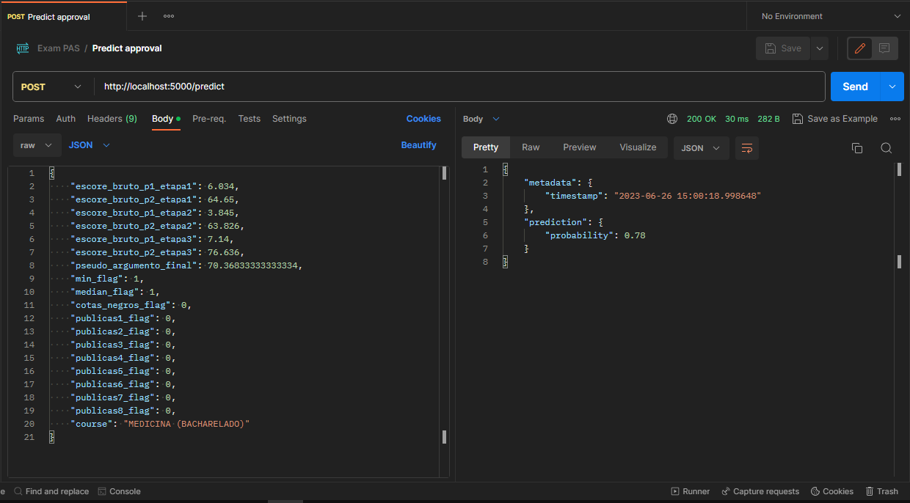

# exam-pas

Este é o repositório do projeto **Exame PAS**. É uma ferramenta - destinada aos estudantes que irão prestar esse exame ou já iniciaram alguma das etapas - capaz de fornecer uma probabilidade de aprovação dado o curso desejado, se é cotista e preferencialmente notas das duas primeiras etapas.

Os dados estão originalmente presentes em *https://www.cebraspe.org.br/pas/subprogramas*, todos em formato .pdf e foram tratados por expressões regulares. Pelo site citado, é possível obter os resultados em cada etapa por meio dos documentos com o título **Resultado final nos itens do tipo D, o resultado final na prova de redação em Língua Portuguesa e o resultado final dos candidatos não eliminados na terceira etapa**. Em relação os dados dos aprovados, o documento que faz mais sentido utilizar é o identificado por **Convocação, em primeira chamada, para o registro acadêmico on-line dos candidatos selecionados dentro do quantitativo de vagas para o primeiro (ou segundo) semestre**, pois possui a lista de aprovados logo após a apuração dos resultados, i.e., aprovados que desistiram de ingressar por qualquer motivo, e.g., passaram em outra universidade, são considerados.

Após a construção das *features*, um modelo Extreme Gradient Boosting (XGBoost) é ajustado. Os dados dos subprogramas 2019-2021 e 2020-2022 foram utlizados do seguinte modo: para treinamento, dados de ambos os subprogramas são considerados, mas o conjunto de dados de teste só apresenta observações de 2020-2022.

No final, o modelo treinado é salvo como .pickle e fica disponível para o script que monta a API por Flask. Por meio dessa API, é possível fazer uma requisição POST com o input dos valores das suas features para obter a predição de probabilidade.

O formato do input deve seguir a seguinte estrutura:

```
{
    "escore_bruto_p1_etapa1": 6.034,
    "escore_bruto_p2_etapa1": 64.65,
    "escore_bruto_p1_etapa2": 3.845,
    "escore_bruto_p2_etapa2": 63.826,
    "escore_bruto_p1_etapa3": 7.14,
    "escore_bruto_p2_etapa3": 76.636,
    "pseudo_argumento_final": 70.36833333333334,
    "min_flag": 1,
    "median_flag": 1,
    "cotas_negros_flag": 0,
    "publicas1_flag": 0,
    "publicas2_flag": 0,
    "publicas3_flag": 0,
    "publicas4_flag": 0,
    "publicas5_flag": 0,
    "publicas6_flag": 0,
    "publicas7_flag": 0,
    "publicas8_flag": 0,
    "course": "MEDICINA (BACHARELADO)"
}
```

  

Mais informações sobre o significado de cada covariável ainda serão detalhadas, no futuro.